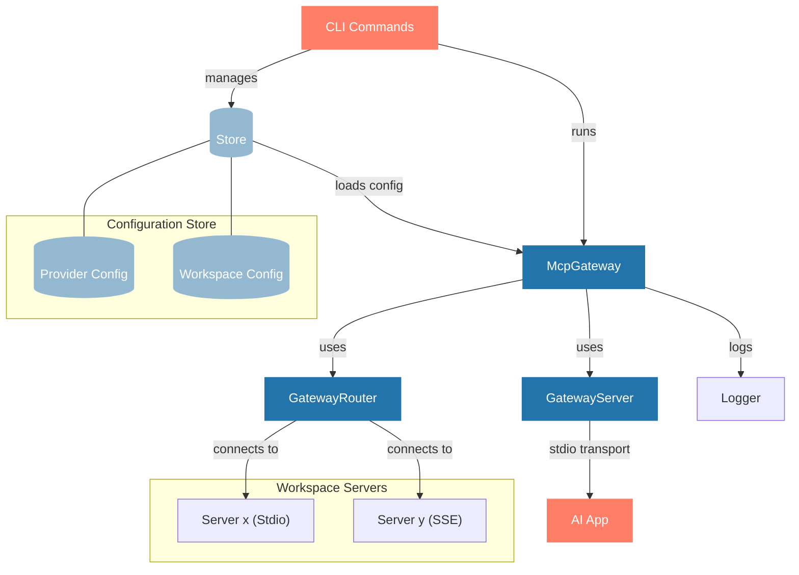

# YAMCP - A Model Context Workspace Manager

YAMCP is a command-line tool for organizing and managing MCP Servers as local workspaces. It enables seamless connection to multiple MCP servers (both local and remote) and bundles them into workspaces for use in AI Apps. All server communications are tracked in a consolidated log store for easy monitoring and debugging.

## 🚀 Quick Start

```bash
# Install YAMCP
npm install -g yamcp  # or use npx yamcp

# Import servers (choose one)
yamcp server import [config]    # import servers from config file (https://example.com)
yamcp server add                # or add manually

# create workspaces (e.g. a yam for coding, design, data, ...)
yamcp yam create

# Run workspace in your AI app
yamcp run <yam-workspace-name>
```
<div align="center">


</div>

## 🔑 Key Concepts

- **MCP Servers**: Remote or local servers that provide Model Context Protocol services
- **Workspaces (YAMs)**: Collections of MCP servers grouped together to be shared with AI Apps (e.g. a workspace for coding, writing, design, magic making!)
- **Gateway**: A local MCP server that manages connections to configured MCP servers in a workspace and exposes them through a unified server to AI App's MCP clients

With YAMCP, you can:

- Create workspaces to group MCP servers by AI application (e.g. Cursor, Claude, GitHub Copilot)
- Group servers by workflow purpose (e.g. software development, data science, technical writing)
- Connect AI apps to a single gateway that provides access to all workspace servers
- Manage and monitor multiple MCP server connections through a unified interface
- Track all server communications with detailed logging and debugging capabilities

## Top-Level Commands

```bash
yamcp [command] [subcommand] [flags]
```

Available top-level commands:

- `server` - Manage MCP providers
- `yam` - Manage workspaces (yams)
- `run` - Run the gateway with a workspace
- `log` - View the server log location

---

## 🔧 **Mcp Server Management Commands**

### Server Commands

```bash
yamcp server add      # Add a new MCP server (interactive)
yamcp server list     # List all configured servers and their status
yamcp server remove   # Remove a server configuration
yamcp server import   # Import server configurations from a JSON file
```

---

## 🍠 **Yam Workspace Management Commands**

### Workspace Commands

```bash
yamcp yam create      # Create a new workspace (interactive)
yamcp yam list        # List all workspaces or show specific workspace details
yamcp yam edit        # Modify an existing workspace configuration
yamcp yam delete      # Delete a workspace configuration
```

### Runtime Commands

```bash
yamcp run <yam-workspace-name>   # Start the gateway with specified workspace
yamcp log                    # View server communication logs
```

---

## ✅ Command Reference

| Command           | Description             | Example                              |
| ----------------- | ----------------------- | ------------------------------------ |
| `server add`      | Add a new MCP server    | `yamcp server add`                   |
| `server list`     | List configured servers | `yamcp server list`                  |
| `server remove`   | Remove a server         | `yamcp server remove [name]`         |
| `server import`   | Import server config    | `yamcp server import [config]`       |
| `yam create`      | Create workspace        | `yamcp yam create`                   |
| `yam list`        | List workspaces         | `yamcp yam list`                     |
| `yam list --name` | Show workspace details  | `yamcp yam list --name my-workspace` |
| `yam edit`        | Edit workspace          | `yamcp yam edit`                     |
| `yam delete`      | Delete workspace        | `yamcp yam delete [workspace-name]`  |
| `run`             | Start gateway           | `yamcp run <workspace-name>`         |
| `log`             | View logs               | `yamcp log`                          |

---

## 🏗️ System Architecture



The diagram shows the main components of the YAMCP system:

- **CLI Commands**: User interface for managing servers and workspaces
- **McpGateway**: Core component that coordinates the Gateway Server and Router
- **GatewayServer**: Handles communication with AI Apps via stdio transport
- **GatewayRouter**: Manages connections to configured MCP servers
- **Logger**: Provides consolidated logging for all components
- **Store**: Manages configuration for providers and workspaces
- **MCP Servers**: Both local (stdio) and remote (SSE) servers that provide MCP services
