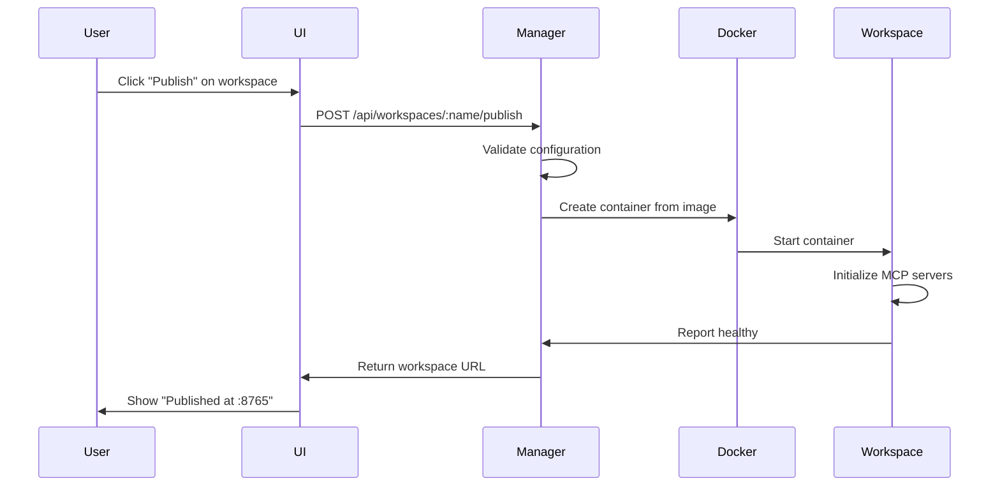

# Dynamic Workspace Publishing Design

**Date**: 2025-01-16  
**Purpose**: Design the "publish" workflow for creating workspace containers

## Core Concept

Transform workspace configuration into running containers with a single click.

## Publishing Flow



## Manager Container Responsibilities

### 1. Configuration Validation
```javascript
async validateWorkspaceConfig(name) {
  const config = await this.loadConfig(name);
  
  // Check all servers exist
  for (const server of config.servers) {
    if (!await this.serverExists(server)) {
      throw new Error(`Server ${server} not found`);
    }
  }
  
  // Check for port conflicts
  const requestedPort = config.port || this.allocatePort();
  if (this.isPortInUse(requestedPort)) {
    throw new Error(`Port ${requestedPort} already in use`);
  }
  
  return { config, port: requestedPort };
}
```

### 2. Container Creation
```javascript
async createWorkspaceContainer(name, config, port) {
  const docker = new Docker();
  
  // Prepare environment variables
  const env = [
    `WORKSPACE_NAME=${name}`,
    `WORKSPACE_CONFIG=${JSON.stringify(config)}`,
    `MCP_PORT=${port}`,
    `AGGREGATION_MODE=${config.mode || 'fastmcp'}`
  ];
  
  // Create container
  const container = await docker.createContainer({
    Image: 'yamcp/workspace:latest',
    name: `workspace-${name}`,
    Env: env,
    HostConfig: {
      PortBindings: {
        '8765/tcp': [{ HostPort: port.toString() }]
      },
      RestartPolicy: { Name: 'unless-stopped' }
    }
  });
  
  await container.start();
  return container;
}
```

### 3. Health Monitoring
```javascript
class WorkspaceHealthMonitor {
  async checkHealth(workspace) {
    try {
      const response = await fetch(`http://localhost:${workspace.port}/health`);
      const data = await response.json();
      
      return {
        healthy: data.status === 'ok',
        servers: data.servers,
        uptime: data.uptime
      };
    } catch (error) {
      return { healthy: false, error: error.message };
    }
  }
  
  startMonitoring(workspace) {
    setInterval(() => {
      this.checkHealth(workspace).then(health => {
        if (!health.healthy) {
          this.handleUnhealthy(workspace);
        }
      });
    }, 30000); // Check every 30 seconds
  }
}
```

## Workspace Container Structure

### Dockerfile
```dockerfile
FROM node:20-alpine
RUN apk add --no-cache python3 py3-pip

# Install MCP servers
RUN npm install -g \
  @modelcontextprotocol/server-context7 \
  @modelcontextprotocol/server-github \
  @modelcontextprotocol/server-filesystem

# Install FastMCP for aggregation
RUN pip install fastmcp uvicorn

# Copy workspace runtime
COPY workspace-runtime /app
WORKDIR /app

# Default to FastMCP mode
ENV AGGREGATION_MODE=fastmcp
EXPOSE 8765

CMD ["./start.sh"]
```

### Startup Script
```bash
#!/bin/bash
# start.sh

case "$AGGREGATION_MODE" in
  fastmcp)
    python3 fastmcp_aggregator.py
    ;;
  supergateway)
    node supergateway_aggregator.js
    ;;
  yamcp)
    yamcp run $WORKSPACE_NAME
    ;;
  *)
    echo "Unknown aggregation mode: $AGGREGATION_MODE"
    exit 1
    ;;
esac
```

## UI Integration

### Workspace Card Enhancement
```jsx
function WorkspaceCard({ workspace }) {
  const [status, setStatus] = useState(workspace.status);
  const [publishing, setPublishing] = useState(false);
  
  const handlePublish = async () => {
    setPublishing(true);
    try {
      const response = await fetch(`/api/workspaces/${workspace.name}/publish`, {
        method: 'POST'
      });
      const data = await response.json();
      setStatus('running');
      toast.success(`Published at port ${data.port}`);
    } catch (error) {
      toast.error(`Failed to publish: ${error.message}`);
    } finally {
      setPublishing(false);
    }
  };
  
  return (
    <Card>
      <h3>{workspace.name}</h3>
      <p>Servers: {workspace.servers.join(', ')}</p>
      <p>Status: {status}</p>
      
      {status === 'configured' && (
        <Button onClick={handlePublish} disabled={publishing}>
          {publishing ? 'Publishing...' : 'Publish Workspace'}
        </Button>
      )}
      
      {status === 'running' && (
        <div>
          <Badge>Running on port {workspace.port}</Badge>
          <Button variant="secondary">View Logs</Button>
          <Button variant="danger">Stop</Button>
        </div>
      )}
    </Card>
  );
}
```

## Port Management Strategy

### Dynamic Allocation
```javascript
class PortAllocator {
  constructor(startPort = 8700, endPort = 8799) {
    this.startPort = startPort;
    this.endPort = endPort;
    this.allocated = new Set();
  }
  
  async allocate() {
    for (let port = this.startPort; port <= this.endPort; port++) {
      if (!this.allocated.has(port) && !await this.isPortInUse(port)) {
        this.allocated.add(port);
        return port;
      }
    }
    throw new Error('No ports available');
  }
  
  release(port) {
    this.allocated.delete(port);
  }
  
  async isPortInUse(port) {
    // Check if port is already bound
    return new Promise((resolve) => {
      const server = require('net').createServer();
      server.once('error', () => resolve(true));
      server.once('listening', () => {
        server.close();
        resolve(false);
      });
      server.listen(port);
    });
  }
}
```

## State Persistence

### Workspace Registry
```javascript
// workspace-registry.json
{
  "workspaces": {
    "dev": {
      "name": "dev",
      "status": "running",
      "container": "workspace-dev",
      "port": 8765,
      "publishedAt": "2025-01-16T10:30:00Z",
      "config": {
        "servers": ["context7", "github"],
        "mode": "fastmcp"
      }
    },
    "prod": {
      "name": "prod", 
      "status": "configured",
      "config": {
        "servers": ["filesystem", "custom"],
        "mode": "supergateway"
      }
    }
  }
}
```

## Cleanup and Lifecycle

### Unpublishing
```javascript
async unpublishWorkspace(name) {
  const workspace = this.registry.get(name);
  
  // Stop container
  const docker = new Docker();
  const container = docker.getContainer(workspace.container);
  await container.stop();
  await container.remove();
  
  // Release port
  this.portAllocator.release(workspace.port);
  
  // Update registry
  workspace.status = 'configured';
  delete workspace.container;
  delete workspace.port;
  
  await this.saveRegistry();
}
```

## Benefits of This Approach

1. **Isolation**: Each workspace completely isolated
2. **Flexibility**: Easy to try different aggregation modes
3. **Scalability**: Can run workspaces on different hosts
4. **Debugging**: Clear container logs per workspace
5. **Rollback**: Easy to stop/restart individual workspaces

## Next Steps

1. Build workspace base image with all dependencies
2. Implement manager API endpoints
3. Create port allocation service
4. Add UI publish button
5. Test with multiple workspaces