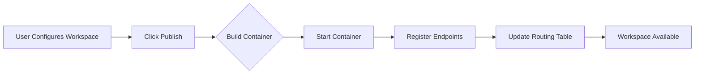

# Multi-Container Architecture Ideation

**Date**: 2025-01-16  
**Context**: Rethinking YAMCP-UI to separate management plane from workspace runtime

## Core Insight

Instead of cramming everything into one container, we separate:
- **Manager Container**: UI, configuration, orchestration
- **Workspace Containers**: Individual runtime environments per workspace

## Key Advantages

### 1. Resource Isolation
- Each workspace gets dedicated resources
- Memory/CPU limits per workspace
- Crashes don't affect other workspaces

### 2. Dynamic Publishing
- "Publish" button creates new container
- Test locally before publishing
- Roll back individual workspaces

### 3. Scaling Options
- Run workspaces on different hosts
- Kubernetes/Swarm compatibility
- Load balance across instances

## The Big Question: Workspace Runtime

What goes inside each workspace container? Three options:

### Option A: SuperGateway per Server
```
Workspace Container
├── SuperGateway Instance 1 → context7
├── SuperGateway Instance 2 → github  
├── SuperGateway Instance 3 → filesystem
└── Aggregation Layer (custom)
```

**Pros**: 
- SuperGateway handles stdio→HTTP perfectly
- Each server gets proper MCP protocol handling
- We know it works

**Cons**:
- Need custom aggregation layer
- Multiple ports to manage
- More complex networking

### Option B: FastMCP Aggregation
```
Workspace Container
├── FastMCP Python Process
│   ├── mount("/context7", stdio_proxy)
│   ├── mount("/github", stdio_proxy)
│   └── mount("/filesystem", stdio_proxy)
└── MCP Server Processes
```

**Pros**:
- Built-in aggregation with FastMCP.mount()
- Handles tool conflicts automatically
- Single port per workspace

**Cons**:
- Python dependency
- Need to understand FastMCP patterns
- Bridge Python→Node.js for SSE

### Option C: YAMCP Direct
```
Workspace Container
└── YAMCP Process
    └── workspace.yaml config
```

**Pros**:
- Exactly what we're trying to replicate
- All aggregation logic included
- Proven to work

**Cons**:
- ES module issues in Docker
- Can't easily expose as HTTP/SSE
- Less control over the process

## Dynamic Publishing Workflow



### Publishing Steps

1. **User Action**: Click "Publish" in UI
2. **Manager Container**:
   - Validates configuration
   - Builds/pulls workspace image
   - Creates container with config
3. **Workspace Container**:
   - Starts FastMCP/SuperGateway/YAMCP
   - Initializes MCP servers
   - Exposes aggregated endpoint
4. **Manager Updates**:
   - Adds route to proxy table
   - Updates UI status
   - Monitors health

## Container Communication

```yaml
# Manager routes requests
/mcp/dev-workspace → http://workspace-dev:8765
/mcp/prod-workspace → http://workspace-prod:8766

# Each workspace container exposes
EXPOSE 8765  # Or dynamic port allocation
```

## Next Questions to Answer

1. **Port Management**: Static vs dynamic allocation?
2. **Config Injection**: Environment vars vs mounted volumes?
3. **Health Monitoring**: How does manager track workspace health?
4. **Cleanup**: When/how to remove stopped workspaces?
5. **Persistence**: Workspace state between restarts?

## Immediate Next Step

Build a proof-of-concept comparing SuperGateway aggregation vs FastMCP to make an informed decision about the workspace runtime architecture.