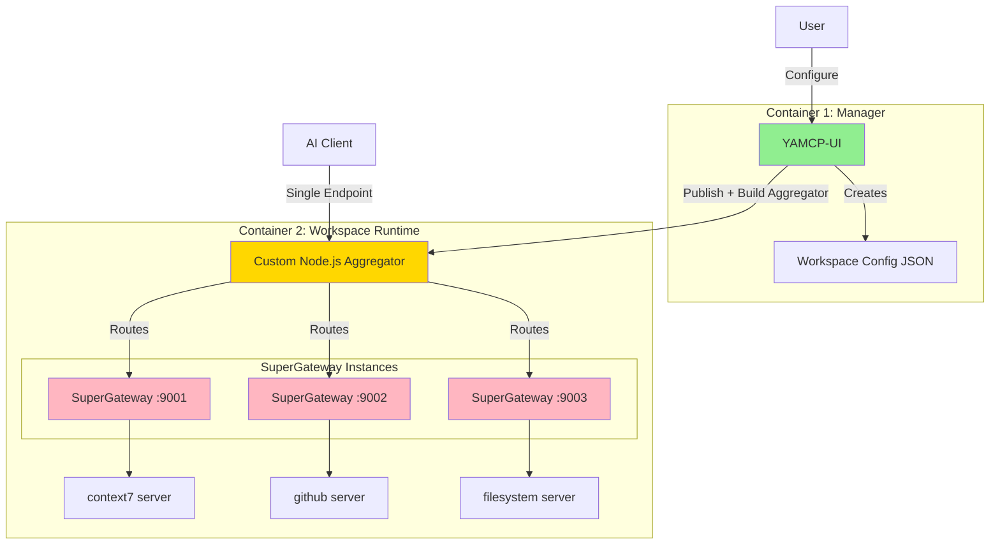

# Cline's Thoughts & Architectural Alignment (2025-01-23)

**Purpose**: This document captures the conversational refinement of the Wave 1 & 2 architecture, aligning the user's vision with the documented options.

## User's Core Vision & Questions

The user's core idea was summarized with a few key questions and statements:

1.  **Can a container instantiate another container?** The goal is for a "Manager" container to spin up "Workspace" containers as siblings.
2.  **Separate Configuration from Execution**: The main UI container should just be a "dumb" configuration editor. It should handle the UI for creating workspaces (like `yamcp-ui`), but this configuration is just JSON data. The Manager itself shouldn't run any MCP logic.
3.  **Use SuperGateway for Execution**: When a user clicks "Publish," the Manager should hand off the JSON config to a new Workspace container. That new container is the "smart" one, responsible for using SuperGateway to run the actual MCP servers. The user explicitly asked, "why use yamcp when we can use supergateway instead to handle all the stuff?"

## Analysis & Alignment

The user's vision aligns perfectly with **Option 2: SuperGateway with Custom Aggregator** as detailed in the `highlevel_diagram.md` and `workspace_runtime_analysis.md` documents.

This model can be described as the **"Dumb Manager, Smart Workspace"** pattern.

### The "Dumb Manager, Smart Workspace" Model

This model clarifies the separation of concerns:

1.  **Container 1 (The Manager - "Dumb" Config Editor):**
    *   Provides a UI for editing workspace configurations.
    *   A "workspace" is simply a JSON object defining the required servers.
    *   The Manager does **not** run any MCP servers. Its sole responsibility is to manage the JSON configs and orchestrate Docker.

2.  **Container 2 (The Workspace - "Smart" Runner):**
    *   Receives the JSON configuration upon creation.
    *   Its only job is to execute: it reads the config and spins up the necessary SuperGateway instances for each MCP server.
    *   It contains all the complexity of running servers and aggregating their tools into a single endpoint.

### Visualizing the Chosen Architecture

This diagram from `highlevel_diagram.md` perfectly represents the user's desired architecture:

### Conclusion & Accepted Trade-offs

By aligning with this model, the project accepts the following trade-offs as noted in the analysis documents:

*   **Pro**: Stays entirely within the Node.js ecosystem.
*   **Pro**: Uses the battle-tested SuperGateway for reliable protocol conversion.
*   **Con**: Requires building and maintaining a **custom Node.js aggregator** inside the workspace container.
*   **Con**: Higher resource usage per workspace due to multiple Node.js processes (aggregator + one SuperGateway per server).

This provides a clear path forward for the proof-of-concept implementation.
