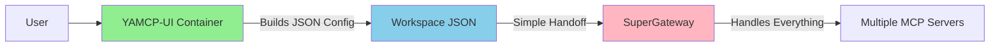
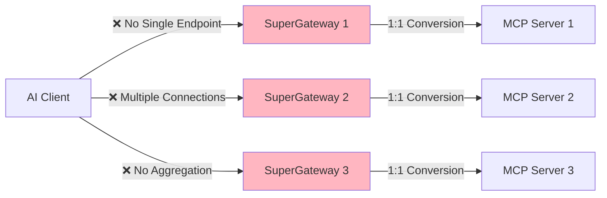
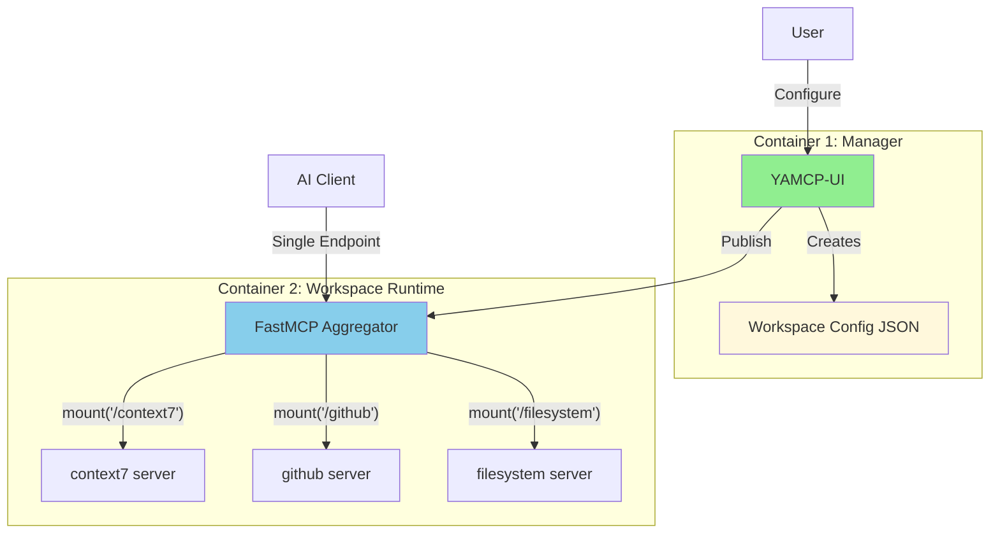
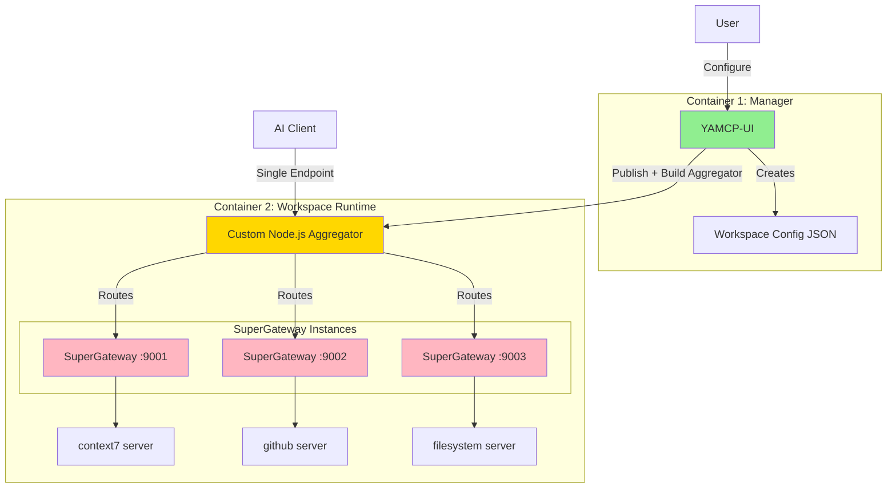
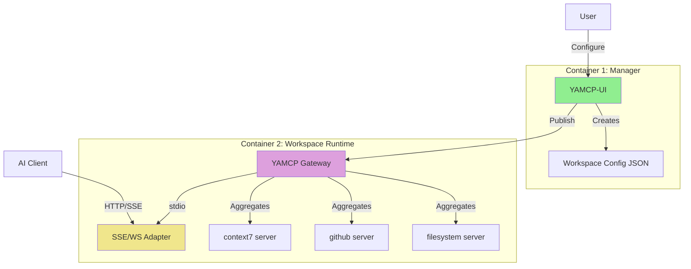
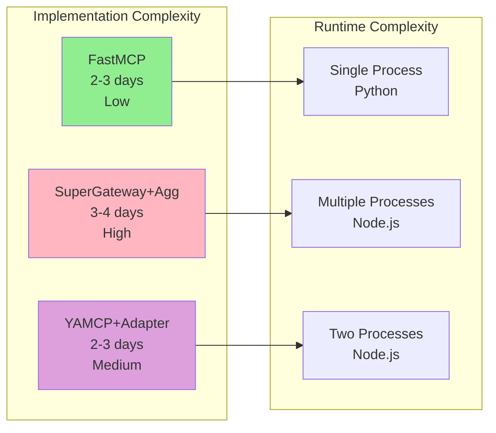

# Wave 2: High-Level Architecture Diagrams

**Date**: 2025-01-23  
**Purpose**: Visual representation of proposed architectures

## Original Wave 2 Vision (Not Feasible)

**Problem**: SuperGateway can't aggregate multiple servers

## Reality: What SuperGateway Actually Does

## Option 1: FastMCP Approach (Recommended)

## Option 2: SuperGateway with Custom Aggregator

## Option 3: Hybrid - YAMCP + Protocol Adapter

## Complexity Comparison

## Key Insight

The original Wave 2 vision assumed SuperGateway could handle workspace aggregation, but it's designed for protocol conversion only. All viable options require an aggregation layer - the question is whether to build one (Option 2) or use an existing solution (Options 1 or 3).