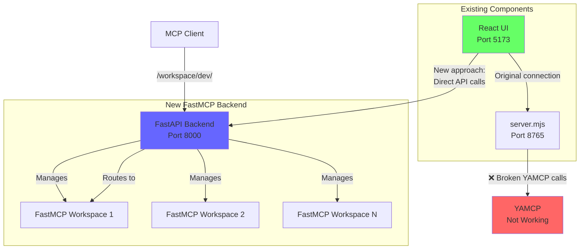
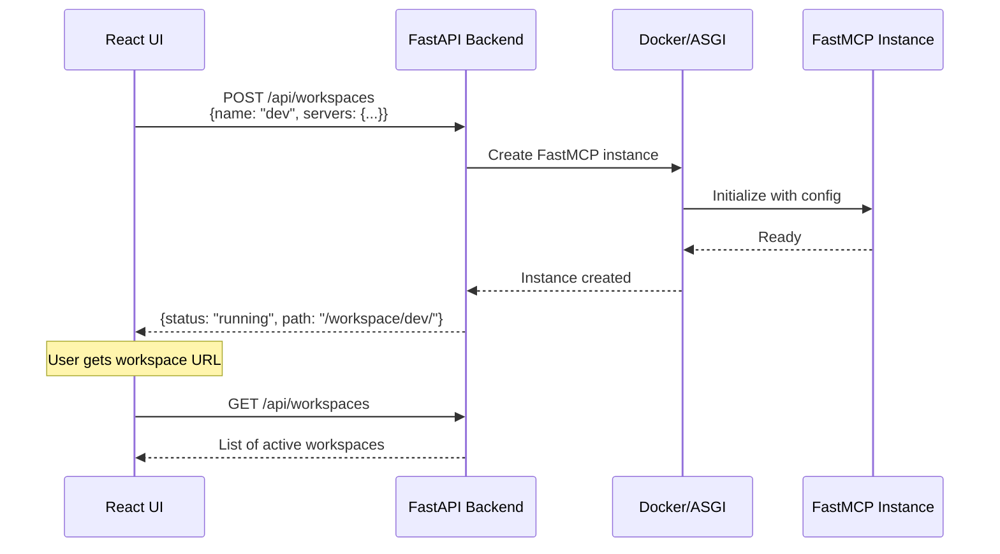

# Wave 5: FastMCP Backend Integration

## Overview

Wave 5 replaces the broken YAMCP backend with a minimal Python FastMCP backend while keeping the existing UI completely unchanged. The UI was originally built for YAMCP, but we're repurposing it by implementing the same API endpoints with FastMCP.

## Architecture



## How It Works

### Current State (Broken)
1. UI runs on port 5173 (development) or is served by server.mjs
2. server.mjs (port 8765) tries to import YAMCP modules
3. YAMCP is broken/incompatible, so nothing works

### New Approach (Wave 5)
1. Keep the UI exactly as is
2. Create a FastAPI backend that implements the same endpoints
3. UI can either:
   - Connect directly to FastAPI (port 8000)
   - Or we update server.mjs to proxy to FastAPI

## API Endpoints Required

The UI expects these endpoints (from analyzing server.mjs):

### Stats & Monitoring
- `GET /api/stats` - Dashboard statistics
- `GET /api/logs` - Log entries
- `GET /api/log-files` - List log files

### Server Management
- `GET /api/servers` - List all MCP servers
- `POST /api/servers` - Add new server
- `PUT /api/servers/:id` - Update server
- `DELETE /api/servers/:id` - Delete server
- `POST /api/servers/:id/start` - Start server
- `POST /api/servers/:id/stop` - Stop server

### Workspace Management
- `GET /api/workspaces` - List workspaces
- `POST /api/workspaces` - Create workspace
- `PUT /api/workspaces/:id` - Update workspace
- `DELETE /api/workspaces/:id` - Delete workspace
- `POST /api/workspaces/:id/start` - Start workspace
- `POST /api/workspaces/:id/stop` - Stop workspace

### Configuration
- `GET /api/config/providers` - Get providers config
- `PUT /api/config/providers` - Update providers config
- `GET /api/config/workspaces` - Get workspaces config
- `PUT /api/config/workspaces` - Update workspaces config

## Implementation Strategy

### Option 1: Direct Integration (Recommended)
```
UI (localhost:5173) → FastAPI (localhost:8000) → FastMCP Workspaces
```

Update the UI to point to the FastAPI backend:
```javascript
// In UI code, change API base URL
const API_BASE = 'http://localhost:8000';
```

### Option 2: Proxy Through server.mjs
```
UI → server.mjs (8765) → FastAPI (8000) → FastMCP Workspaces
```

Modify server.mjs to proxy requests to FastAPI instead of using YAMCP.

## Key Design Decisions

1. **No YAMCP Dependency**: The new backend doesn't use YAMCP at all
2. **Minimal Changes**: UI remains completely unchanged
3. **Simple Architecture**: FastAPI + FastMCP, no complex state management
4. **Path-based Routing**: Workspaces accessible at `/workspace/{name}/`
5. **In-Memory State**: No database needed for MVP

## Data Flow



## File Structure

```
wave_5/
├── README.md                    # This file
├── backend-dev-spec.md         # Detailed backend specification
├── ui-integration-guide.md     # How to connect UI to backend
├── quick-start.md              # Minimal working example
├── backend/
│   ├── main.py                 # FastAPI application
│   ├── models.py               # Pydantic models
│   ├── requirements.txt        # Python dependencies
│   └── Dockerfile              # Container for backend
└── docker-compose.yml          # Full stack orchestration
```

## Quick Start

1. **Run the FastMCP Backend**:
   ```bash
   cd wave_5/backend
   pip install fastapi fastmcp uvicorn
   python main.py
   ```

2. **Run the Existing UI**:
   ```bash
   cd ../..  # back to project root
   npm install
   npm run dev
   ```

3. **Configure UI to use new backend**:
   - Update API calls to point to `http://localhost:8000`
   - Or set up proxy in vite.config.js

## Benefits

- ✅ **Reuses existing UI** - No frontend work needed
- ✅ **Simple Python backend** - ~200 lines of code
- ✅ **FastMCP native aggregation** - Using mount() method
- ✅ **Clean architecture** - UI → FastAPI → FastMCP
- ✅ **No YAMCP dependency** - Completely independent

## Next Steps

1. Implement the minimal FastAPI backend
2. Test with existing UI
3. Add Docker support for production deployment
4. Consider adding authentication and persistence

## Why This Works

The original YAMCP-UI was designed as a UI for YAMCP, but it's really just a React app that makes HTTP API calls. By implementing the same API endpoints in our FastMCP backend, we can reuse the entire UI without any modifications. The UI doesn't care what's behind the API - it just needs the endpoints to return the expected JSON responses.