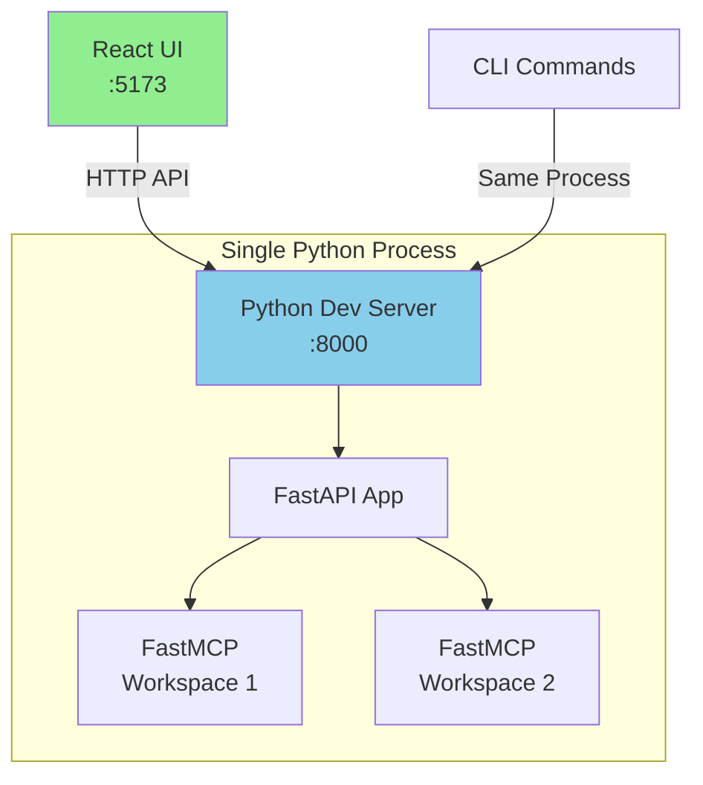
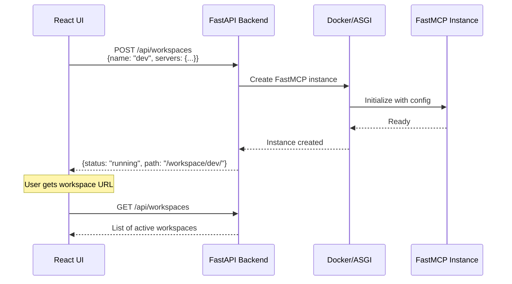

# Wave 5: FastMCP Dev Server (MVP)

## ⚠️ DEVELOPMENT ENVIRONMENT - NOT FOR PRODUCTION ⚠️

This is a minimal dev server that replaces YAMCP with FastMCP for development use.

## Overview

Wave 5 creates a pure Python dev server that:
- Replaces the broken YAMCP backend
- Keeps the existing UI completely unchanged
- Runs everything in a single Python process (no Docker!)
- Provides both CLI and HTTP interfaces

## Quick Start (5 Minutes)

```bash
# 1. Install dependencies
pip install fastapi fastmcp uvicorn typer

# 2. Start the dev server
python dev_server.py serve

# 3. In another terminal, start the UI
npm run dev

# Done! UI should work with the new backend
```

## Architecture



## What This Is

A **working dev server** that replaces YAMCP with FastMCP. Features:
- ✅ ~100 lines of Python
- ✅ Both CLI and HTTP interfaces  
- ✅ In-process FastMCP mounting (no Docker needed)
- ✅ Hot reload for development
- ✅ Real MCP server aggregation via FastMCP
- ⚠️ No persistence (resets on restart - by design for dev)
- ⚠️ No production features (auth, monitoring, etc.)

## CLI Usage

The dev server includes a CLI for testing without the UI:

```bash
# Start server
python dev_server.py serve

# Create workspace
python dev_server.py create my-workspace config.json

# List workspaces  
python dev_server.py list

# Delete workspace
python dev_server.py delete my-workspace
```

## API Endpoints (Minimal for MVP)

| Endpoint | Purpose | Implemented |
|----------|---------|-------------|
| `POST /api/workspaces/{name}` | Create workspace | ✅ |
| `GET /api/workspaces` | List workspaces | ✅ |
| `DELETE /api/workspaces/{name}` | Delete workspace | ✅ |
| `GET /api/stats` | Dashboard stats | ✅ (basic) |
| Everything else | Not needed for MVP | ❌ |

## Key Design Decisions

1. **No YAMCP Dependency**: The new backend doesn't use YAMCP at all
2. **Minimal Changes**: UI remains completely unchanged
3. **Simple Architecture**: FastAPI + FastMCP, no complex state management
4. **Path-based Routing**: Workspaces accessible at `/workspace/{name}/`
5. **In-Memory State**: No database needed for MVP

## Data Flow



## File Structure

```
wave_5/
├── README.md                    # This file
├── backend-dev-spec.md         # Detailed backend specification
├── ui-integration-guide.md     # How to connect UI to backend
├── quick-start.md              # Minimal working example
├── backend/
│   ├── main.py                 # FastAPI application
│   ├── models.py               # Pydantic models
│   ├── requirements.txt        # Python dependencies
│   └── Dockerfile              # Container for backend
└── docker-compose.yml          # Full stack orchestration
```

## Quick Start

1. **Run the FastMCP Backend**:
   ```bash
   cd wave_5/backend
   pip install fastapi fastmcp uvicorn
   python main.py
   ```

2. **Run the Existing UI**:
   ```bash
   cd ../..  # back to project root
   npm install
   npm run dev
   ```

3. **Configure UI to use new backend**:
   - Update API calls to point to `http://localhost:8000`
   - Or set up proxy in vite.config.js

## Benefits

- ✅ **Reuses existing UI** - No frontend work needed
- ✅ **Simple Python backend** - ~200 lines of code
- ✅ **FastMCP native aggregation** - Using mount() method
- ✅ **Clean architecture** - UI → FastAPI → FastMCP
- ✅ **No YAMCP dependency** - Completely independent

## Next Steps

1. Implement the minimal FastAPI backend
2. Test with existing UI
3. Add Docker support for production deployment
4. Consider adding authentication and persistence

## Why This Works

The original YAMCP-UI was designed as a UI for YAMCP, but it's really just a React app that makes HTTP API calls. By implementing the same API endpoints in our FastMCP backend, we can reuse the entire UI without any modifications. The UI doesn't care what's behind the API - it just needs the endpoints to return the expected JSON responses.