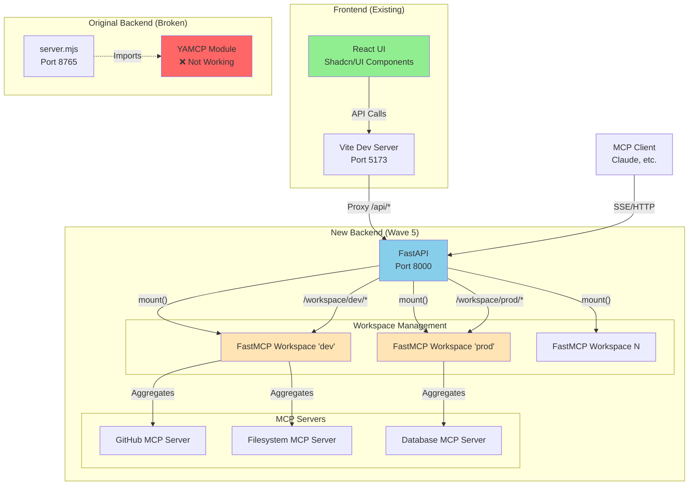
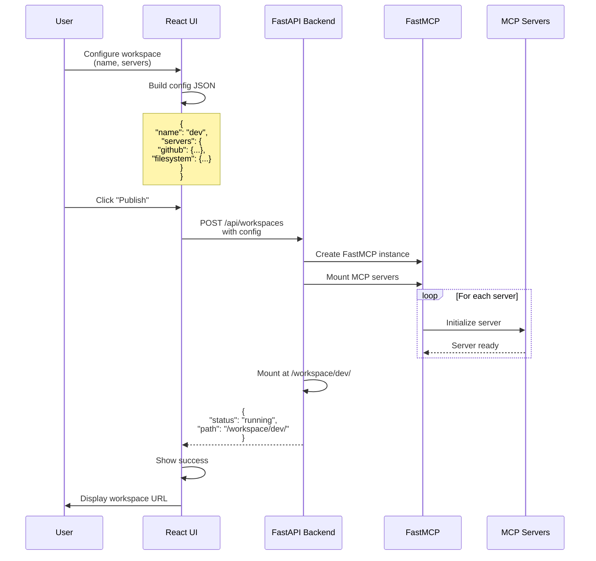
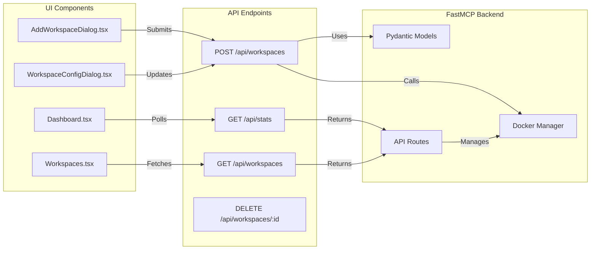
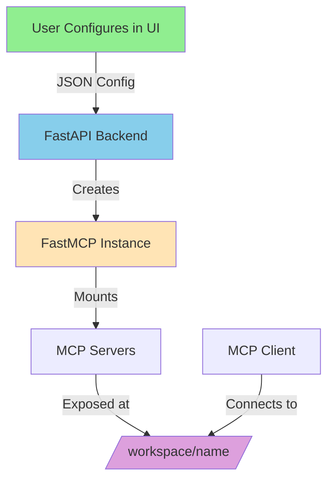
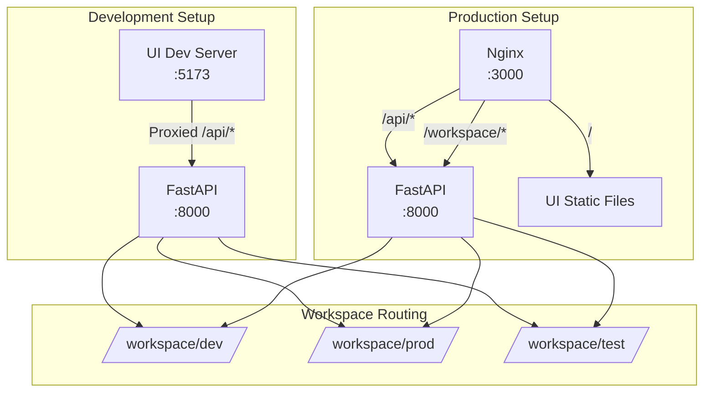

# Wave 5 Architecture Diagrams

## Complete System Architecture

## Data Flow for Workspace Creation

## Component Interaction Diagram

## Simplified Mental Model

## Port Mapping

## Key Points

1. **UI Independence**: The React UI has no direct YAMCP dependencies - it only makes HTTP API calls
2. **Clean Separation**: UI builds config → Backend manages containers → FastMCP handles MCP complexity
3. **Path-based Routing**: Each workspace gets its own URL path, no port management needed
4. **Native Aggregation**: FastMCP's mount() method handles multi-server aggregation
5. **Simple State**: Everything runs in-memory, no database required for MVP