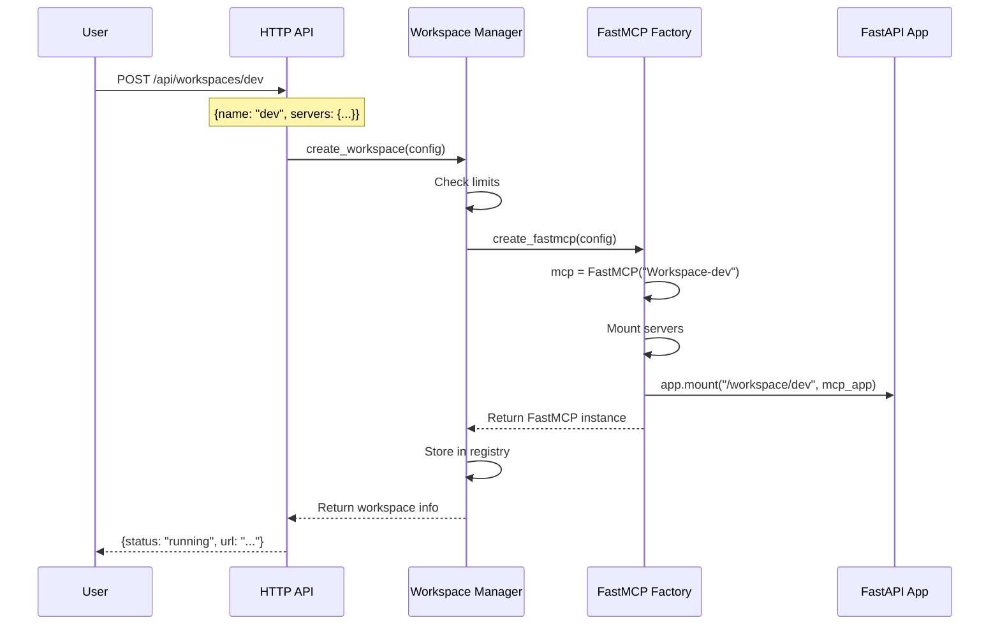
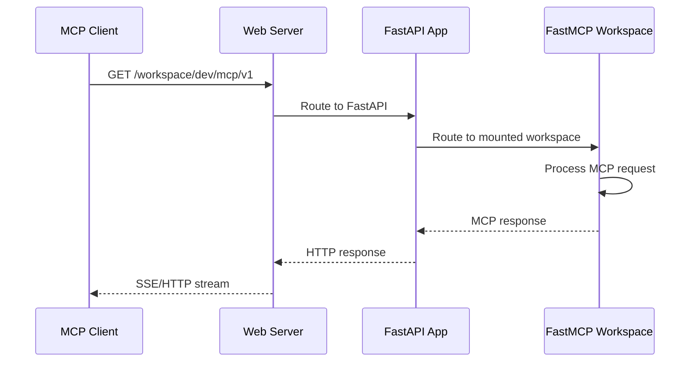

# Backend Architecture Overview

## High-Level Components

```mermaid
graph TB
    subgraph "Entry Points"
        CLI[CLI Interface<br/>typer]
        HTTP[HTTP API<br/>FastAPI]
    end
    
    subgraph "Core Logic"
        WM[Workspace Manager<br/>Dict[str, FastMCP]]
        FM[FastMCP Factory<br/>Creates & Mounts]
    end
    
    subgraph "MCP Layer"
        FMC1[FastMCP Instance 1]
        FMC2[FastMCP Instance 2]
        FMCN[FastMCP Instance N]
    end
    
    CLI --> WM
    HTTP --> WM
    WM --> FM
    FM --> FMC1
    FM --> FMC2
    FM --> FMCN
```

## Component Responsibilities

### 1. Entry Points Layer

#### CLI Interface (Typer)
**Purpose**: Command-line management of workspaces  
**Responsibilities**:
- Parse command-line arguments
- Call workspace manager functions
- Display results to terminal

**Commands**:
```python
@cli.command()
def serve()      # Start HTTP server
def create()     # Create workspace from config
def list()       # List active workspaces  
def delete()     # Remove workspace
```

#### HTTP API (FastAPI)
**Purpose**: RESTful API for UI integration  
**Responsibilities**:
- Handle HTTP requests/responses
- CORS for browser access
- Route to workspace manager
- Serve Swagger docs

**Endpoints**:
```python
POST   /api/workspaces/{name}    # Create/update workspace
GET    /api/workspaces           # List all workspaces
DELETE /api/workspaces/{name}    # Delete workspace
GET    /api/stats                # Dashboard statistics
```

### 2. Core Logic Layer

#### Workspace Manager
**Purpose**: Central workspace state management  
**Responsibilities**:
- Maintain workspace registry (in-memory dict)
- Enforce limits (MAX_WORKSPACES)
- Coordinate creation/deletion
- Generate workspace metadata

**Data Structure**:
```python
workspaces: Dict[str, FastMCP] = {}
# Key: workspace name
# Value: FastMCP instance
```

#### FastMCP Factory
**Purpose**: Create and configure FastMCP instances  
**Responsibilities**:
- Parse workspace configuration
- Create FastMCP instance with name
- Mount MCP servers based on config
- Configure transport (SSE/HTTP)
- Return configured instance

**Process**:
```python
def create_fastmcp_workspace(config: WorkspaceConfig) -> FastMCP:
    # 1. Create FastMCP instance
    mcp = FastMCP(f"Workspace-{config.name}")
    
    # 2. For each server in config
    for server_name, server_config in config.servers.items():
        # Mount server (future: real MCP servers)
        mount_mcp_server(mcp, server_name, server_config)
    
    # 3. Create ASGI app for HTTP transport
    workspace_app = mcp.streamable_http_app()
    
    # 4. Mount to main FastAPI app
    app.mount(f"/workspace/{config.name}", workspace_app)
    
    return mcp
```

### 3. MCP Layer

#### FastMCP Instances
**Purpose**: Aggregate multiple MCP servers  
**Responsibilities**:
- Handle MCP protocol communication
- Route requests to appropriate servers
- Manage tool/resource namespacing
- Provide unified endpoint

**Key Features**:
- Each workspace is independent
- Mounted at `/workspace/{name}/`
- Exposes tools from all mounted servers
- Handles SSE/HTTP transport

## Data Flow

### Creating a Workspace



### Accessing a Workspace



## Key Design Principles

### 1. Separation of Concerns
- **Entry points** handle I/O formatting
- **Core logic** manages state
- **MCP layer** handles protocol specifics

### 2. Single Responsibility
- Each component has one clear job
- Easy to understand and modify
- Minimal coupling between layers

### 3. In-Memory Simplicity
- No database complexity
- State resets on restart (feature for dev)
- Fast and predictable

### 4. Extensibility Points
- Easy to add new CLI commands
- Simple to add API endpoints
- Can swap mock servers for real ones
- Transport can be changed (SSE/HTTP/WebSocket)

## Implementation Priorities

### Phase 1: Core Structure (Current)
- [x] Basic CLI with serve command
- [x] FastAPI with CORS
- [x] Workspace creation endpoint
- [x] In-memory workspace storage
- [x] Basic FastMCP mounting

### Phase 2: Real MCP Servers
- [ ] Parse server config properly
- [ ] Spawn actual MCP server processes
- [ ] Mount via FastMCP mount() API
- [ ] Handle server failures gracefully

### Phase 3: Enhanced Features
- [ ] Workspace configuration validation
- [ ] Health check endpoints
- [ ] Structured logging
- [ ] Metrics collection
- [ ] WebSocket support

## Configuration Schema

### Input: WorkspaceConfig
```typescript
{
  name: string,
  servers: {
    [serverName: string]: {
      command: string,      // e.g., "mcp-server-github"
      args: string[],       // e.g., ["--token", "${GITHUB_TOKEN}"]
      env?: {[key: string]: string}
    }
  }
}
```

### Output: WorkspaceStatus
```typescript
{
  name: string,
  status: "running" | "error",
  url: string,              // e.g., "http://localhost:8000/workspace/dev/mcp/v1"
  health: {
    status: "healthy" | "unhealthy",
    servers: {[name: string]: "running" | "failed"}
  }
}
```

## Error Handling Strategy

### Graceful Degradation
- If a server fails to mount, workspace still runs
- Return partial success with error details
- Log errors but don't crash

### User-Friendly Messages
- API returns clear error messages
- CLI shows helpful error text
- Include actionable next steps

### Recovery
- Workspaces can be recreated
- No persistent state to corrupt
- Simple restart fixes most issues